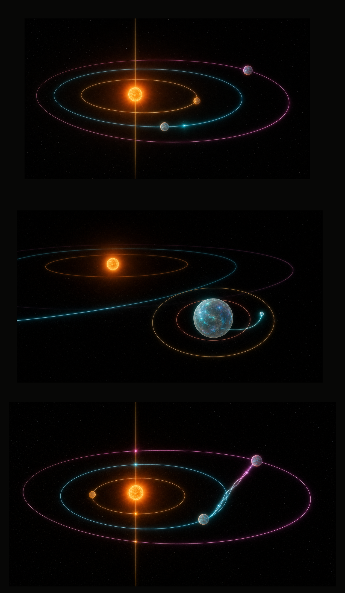
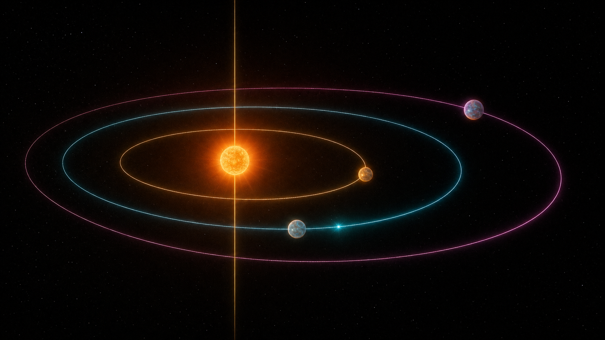
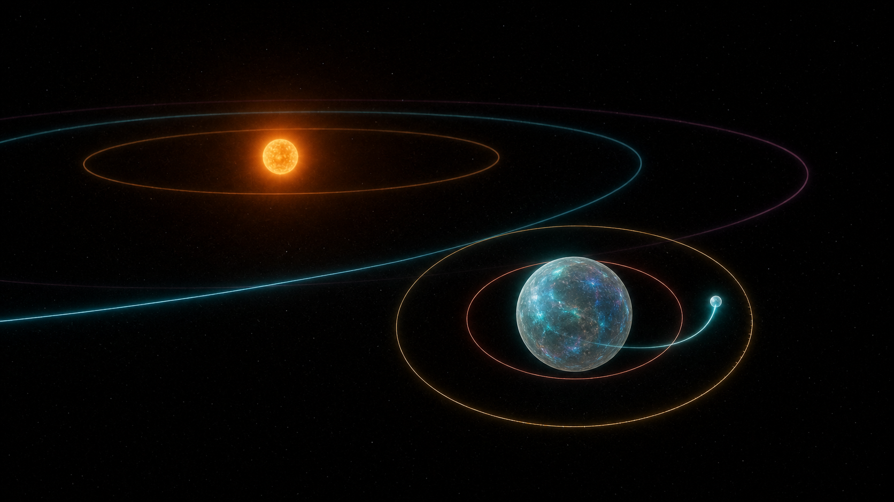
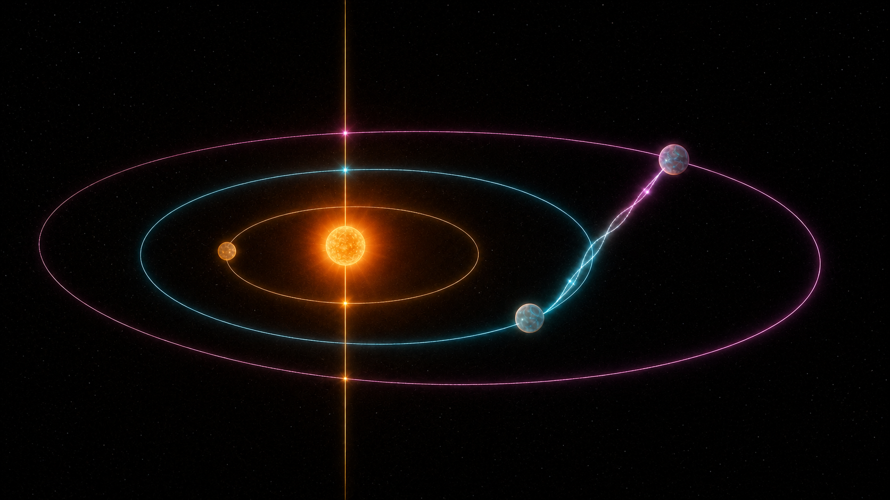

# Relativity Gramophone — Orbit Harp

## Решение

Relativity Gramophone становится орбитальной арфой с иглой времени.

- орбита — струна;
- планета — голос;
- спутник — обертон и ритмическое подразделение родительского голоса;
- неподвижный световой меридиан — игла, автоматически считывающая прохождение тела;
- цвет — постоянная тембровая семья;
- бегущий по орбите импульс — звучащая сейчас нота;
- связь между планетами появляется только при физическом орбитальном резонансе.

Ни один яркий свет не является декорацией. Если объект ярко светится, он либо звучит, либо показывает физически значимое событие.

## 01. Основная сцена

Три планеты движутся по трём отдельным замкнутым струнам. Золотой меридиан неподвижен относительно сцены. При пересечении меридиана планетой:

1. точка пересечения вспыхивает;
2. по соответствующей орбите проходит цветовой импульс;
3. звучит нота этого голоса;
4. вспышка и звук имеют одну временную огибающую.

### Управление

- `PLAY / PAUSE` — запускает и останавливает небесный секвенсор;
- провести через одну орбиту — сыграть отдельную струну;
- провести через несколько орбит — исполнить глиссандо;
- коснуться планеты — выбрать её и услышать голос;
- `ADD PLANET` — создать новую основную орбиту;
- `EXPLORE` — отдельно включить свободный полёт камеры.

В режиме композиции камера не вращается сама и мягко удерживает всю активную систему в безопасной области кадра.

## 02. Создание планеты

Сохраняется действующий жест из центра:

1. `ADD PLANET` переводит сцену в режим рождения;
2. пользователь тянет от звезды;
3. появляется полная будущая орбита, а расстояние предварительно озвучивает высоту;
4. разрешённые устойчивые дорожки подсвечиваются цветом будущего голоса;
5. пересекающая соседнюю орбиту траектория становится коралловой и не может быть подтверждена;
6. отпускание создаёт планету и начинает её первую ноту.

Скрытого исправления после рождения нет: интерфейс предлагает физически допустимое начальное состояние, после чего работает детерминированная N-body симуляция.

## 03. Создание спутника

Спутники раскрываются прогрессивно и не добавляют глобальную панель:

1. пользователь выбирает планету;
2. камера плавно приближает её семейство, но оставляет звезду видимой как системный якорь;
3. рядом с планетой появляется локальное действие `ADD MOON`;
4. вокруг планеты показывается разрешённый пояс;
5. внутренняя коралловая граница обозначает опасную близость;
6. внешняя золотая граница обозначает предел устойчивой спутниковой орбиты;
7. перетаскивание выбирает период и слышимый интервал;
8. отпускание рождает маленькую локальную струну.

Планета остаётся фундаментом. Первый спутник добавляет гармонический интервал, второй — ритмическое или тембровое усложнение. Спутники не становятся случайными независимыми голосами.

## 04. Резонанс

Постоянных линий между движущимися планетами нет. Связь возникает только когда отношение орбитальных периодов попадает в допустимую область реального резонанса:

- `2:1` — октавная структура;
- `3:2` — квинтовая структура;
- `4:3` — квартовая структура;
- `5:4` — терцовая структура;
- `5:3` — расширенная гармония.

В момент резонанса между парой тел появляется одна стоячая волна, составленная из цветов обоих голосов. Количество видимых узлов соответствует отношению. Остальные планеты не получают связей.

Резонанс одновременно влияет на:

- повторяемость ритма;
- устойчивость аккорда;
- форму стоячей волны;
- яркость совместной атаки;
- визуальное обозначение отношения.

## 05. Физическая устойчивость

Composer Mode допускает только устойчивые начальные состояния, но не подменяет последующую физику.

### Планеты

- не более пяти основных орбит;
- интервалы перицентр–апоцентр не пересекаются при создании;
- минимальное расстояние учитывает массы соседних тел;
- эксцентриситет по умолчанию ограничен спокойным музыкальным диапазоном;
- более рискованные системы доступны отдельным пресетом `CHAOS`.

### Спутники

- не более двух спутников на планету;
- суммарно не более двенадцати тел;
- внутренняя граница исключает столкновение и разрушение спутника;
- внешняя граница составляет безопасную долю сферы Хилла;
- начальная скорость задаётся относительно родительской планеты и её локального барицентра;
- после рождения спутник участвует в общей N-body симуляции.

Если предложенное состояние неустойчиво, интерфейс показывает причину до отпускания жеста. Нет молчаливого рождения, невидимой автокоррекции или запасного значения.

## 06. Сонфикация

| Физика | Музыка | Свет |
| --- | --- | --- |
| Орбитальный период | ритм и фундаментальная высота | радиус струны |
| Масса | плотность и вес тембра | размер и глубина свечения |
| Эксцентриситет | акцент перицентра и рубато | вытянутость орбиты |
| Спутниковый период | subdivision родительского голоса | локальная малая струна |
| Собственное время | фазовый дрейф | личное кольцо-час |
| Радиальная скорость | тонкий pitch bend | тёпло-холодный доплеровский сдвиг |
| Резонанс | устойчивый интервал и полиритм | временная стоячая волна |

Звук остаётся честно обозначенной сонфикацией, а не утверждением о распространении обычного звука в вакууме.

## 07. Состояния интерфейса

### Listen

Первый запуск показывает одну строку: `PRESS PLAY — THE LIGHT NEEDLE HEARS EVERY CROSSING`.

После первого пересечения подсказка исчезает навсегда.

### Pluck

При первом наведении или касании орбита слегка приподнимается световой волной. Подсказка: `SWIPE ACROSS AN ORBIT TO PLUCK`.

### Planet selected

Остальная сцена приглушается не более чем на 20%. Возле выбранного тела появляются `ADD MOON` и название голоса. Все глобальные инструменты остаются на своих местах.

### Moon birth

Сцена показывает только локальную область устойчивости и будущую орбиту. Остальные объяснения скрыты.

### Resonance

Короткая подпись `3:2 RESONANCE` возникает около стоячей волны и исчезает после фиксации. В системной панели сохраняется найденная печать.

### Explore

Свободный полёт, наклон и камера-follow доступны только после явного выбора `EXPLORE`. Возврат `COMPOSITION` восстанавливает стабильную музыкальную камеру.

## 08. Критерии готовности

- новый пользователь извлекает первую осознанную ноту не позднее чем через 10 секунд;
- после одной демонстрации пользователь может объяснить: «орбита — струна, луч — игла, цвет — голос»;
- в Composer Mode активные тела не покидают кадр;
- ни одна цветная связь не появляется без резонанса;
- орбиты доступны для касания и на паузе, и при воспроизведении;
- рождение планеты и спутника всегда имеет полную предварительную траекторию;
- одна и та же композиция детерминированно воспроизводит планеты, спутники, импульсы и резонансы у получателя;
- режим reduced motion сохраняет музыкальную причинность, уменьшая только частицы, bloom и движение камеры;
- цвет всегда дублируется названием голоса, формой импульса и тактильным событием.

## 09. Порядок реализации

1. заменить движущиеся шлейфы на стабильные замкнутые орбитальные струны;
2. добавить иглу времени и единый note-event для света и Web Audio;
3. исправить Composer-камеру и гарантировать удержание системы в кадре;
4. добавить выбор планеты и локальное действие `ADD MOON`;
5. расширить физическое состояние и формат записи родительской связью спутника;
6. реализовать ограничения устойчивости и preview разрешённого пояса;
7. заменить постоянные связи временной резонансной волной;
8. провести аудио-, touch-, performance- и deterministic replay QA.
