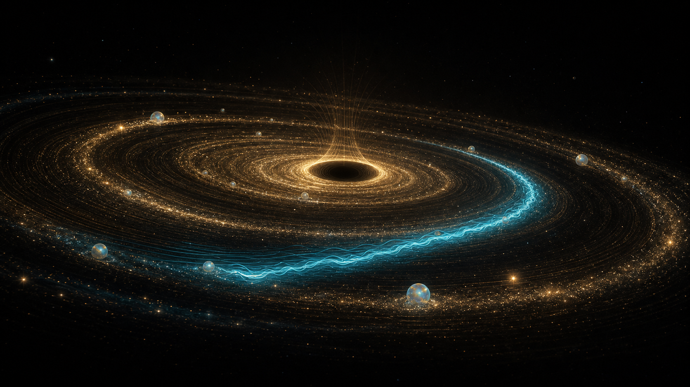
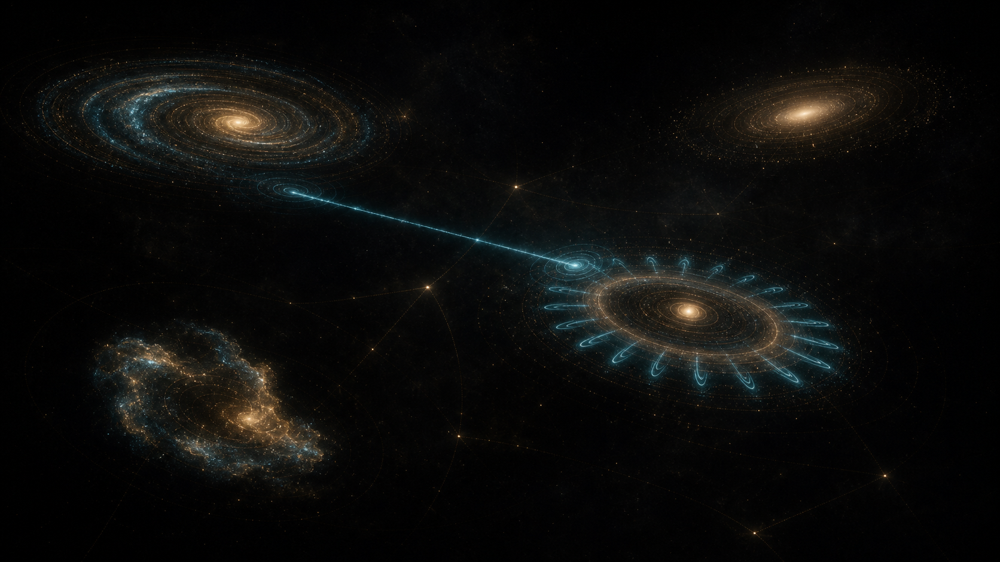
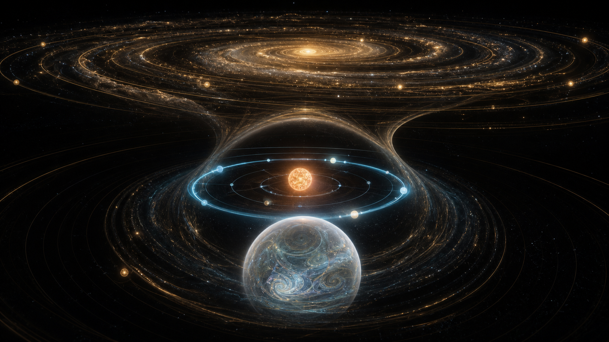
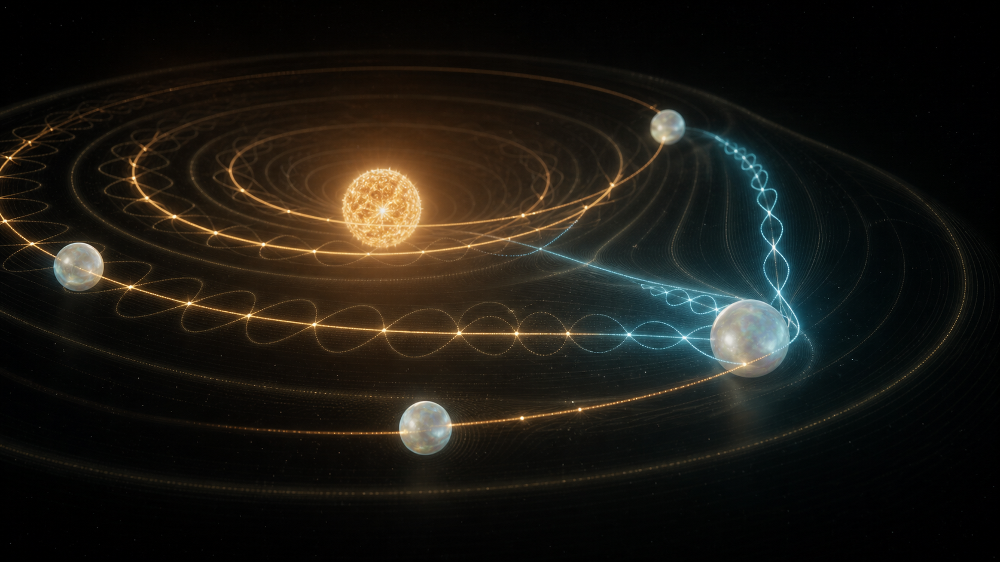
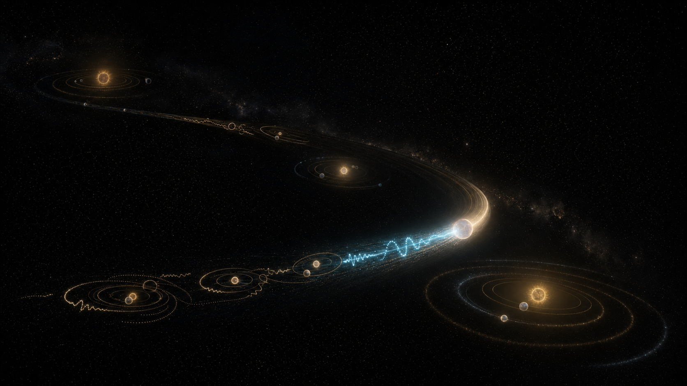
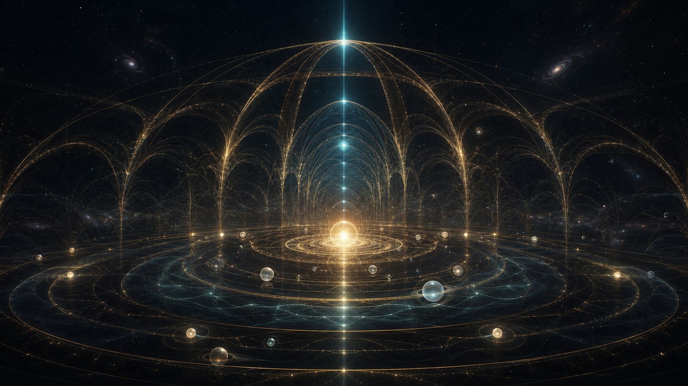
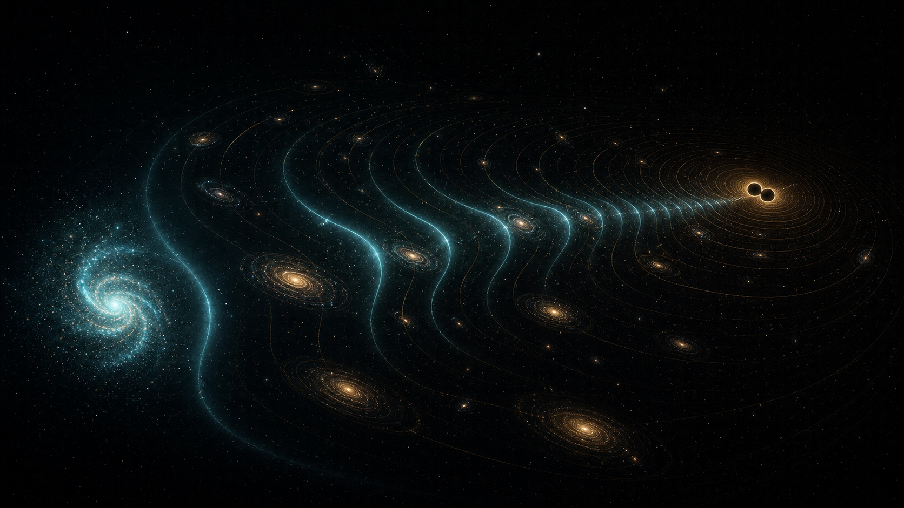

# WAI Gramophone — Deep Universe Council

## Решение

Главная метафора:

> Вселенная — это граммофон, который играет гравитацией.

Это не космический screensaver и не обычный секвенсор в форме планет. Игрок выращивает звучащую систему, настраивает её телами и расстояниями, слушает её на разных масштабах и постепенно отпускает музыку в память галактики.

## Совет

Концепцию независимо разобрали:

- три Codex-агента: звук и гармония, игровая механика, художественная система;
- три Claude Code-агента на модели Fable: композитор-физик, игровой режиссёр, арт-критик;
- отдельный Fable-председатель, который снял противоречия и собрал итоговую систему.

Первая длинная Fable-сессия оборвалась с точной ошибкой `API Error: Connection closed mid-response`. Модель не менялась: обсуждение было продолжено короткими специализированными раундами на Fable.

## Творческая конституция

### Один мир, четыре масштаба

Механика остаётся одной и той же на каждом уровне:

1. звезда и её планеты;
2. планета и её луны;
3. галактика и её звёздные системы;
4. вселенная и её галактики.

При зуме меняется не только размер объектов, а музыкальный смысл:

- тело становится голосом;
- система — аккордом;
- галактика — макроинструментом;
- вселенная — медленно меняющейся формой произведения.

### Четыре музыкальных жеста

1. **Потянуть от источника** — родить дочернее тело: звезда → планета, планета → луна, ядро галактики → система.
2. **Провести поперёк орбиты или светового пути** — сыграть его, как струну.
3. **Сделать pinch или колесо** — перейти на другой смысловой масштаб, а не просто увеличить картинку.
4. **Удерживать и двигать в пустом пространстве** — играть монофоническим гравитационным терменвоксом.

Обычный тап только выбирает и даёт коротко услышать объект. Он не открывает панели и не создаёт новый режим.

### Музыкальная физика

- Звезда задаёт тональный центр системы.
- Планеты тяготеют к устойчивым отношениям `1:1`, `9:8`, `5:4`, `4:3`, `3:2`, `5:3`, `15:8`, `2:1`.
- Между устойчивыми областями возникают биения и напряжение; звук не жёстко квантуется, а мягко притягивается к гармонии.
- Луны не становятся дополнительными громкими голосами. Они изменяют тембр, пульсацию и обертоны родительской планеты.
- Камера работает как микшер внимания: близкое раскрывается подробно, система звучит как аккорд, далёкая галактика — как единое дыхание.
- Млечный Путь хранит тихий след сыгранных систем и постепенно превращается в космический хор.
- Комета переносит фрагмент музыкальной памяти между системами.
- Чёрная дыра — отрицательный инструмент: она убирает спектр, растягивает время и завершает сторону пластинки тишиной.
- Гравитационная волна — редкое глобальное событие с восходящим chirp, а не постоянный декоративный эффект.

### Правило изобилия

Изобилие создаётся глубиной, временем и неожиданными редкими событиями — не одновременным количеством частиц, вспышек и голосов.

- Один главный феномен в кадре.
- Не более двух активных цветовых семейств плюс золото.
- Быстрая реакция на жест, затем длинное спокойное затухание.
- Автоматические события редкие и структурные.
- Активный голос всегда понятен по свету.

### Цвет как смысл

- **Золото** — память, гравитация, устойчивая гармония.
- **Циан** — действие игрока и звучащее настоящее.
- **Опал** — ещё не раскрытый потенциал тела.
- **Чёрный** — пространство и активная тишина.

## Семь направлений

### 01. Living Milky Way Record

Млечный Путь читается как гигантская живая пластинка. Чёрная дыра — её центр и финальная тишина, циановая волна — текущая проигрываемая фраза. Это лучшая глобальная идентичность проекта.

### 02. Choir of Galaxies

Несколько галактик становятся разными тембровыми семействами и отвечают друг другу световыми фразами. Подходит для поздней стадии и совместных произведений, но не для первого экрана.

### 03. Semantic Descent

Непрерывный переход от галактики к звёздной системе и отдельному миру. Это ключ к ощущению «летать и зумить»: приближение раскрывает новую музыкальную структуру, а не просто более крупную графику.

### 04. Elastic Harmony Field

Орбиты становятся видимыми стоячими волнами. Устойчивые отношения образуют ясные фигуры, напряжённые — медленно расходящиеся биения. Это основа понятной связи физики, цвета и звука.

### 05. The Comet Remembers

Комета собирает сыгранный мотив и переносит его в следующую систему. След показывает не скорость ради красоты, а реальную музыкальную память. Это создаёт путешествие и развитие произведения.

### 06. Cathedral of Resonance

Редкий кульминационный момент: несколько устойчивых систем входят в общий резонанс, и их дуги на короткое время строят световой собор. Затем всё возвращается в почти полную тишину.

### 07. The Chirp That Bends the Universe

Гравитационная волна проходит через галактики и на секунды синхронизирует их ритм. Это редкое вселенское событие, которое должно ощущаться как чудо, а не как ещё одна анимация.

## Рекомендуемый синтез

Не выбирать одно изображение буквально, а собрать продукт из четырёх:

- **01** — главная идентичность и дальний масштаб;
- **04** — повседневная физика и музыкальная игра;
- **05** — путешествие, память и развитие композиции;
- **06** — редкая награда и кульминация.

Направление **03** задаёт архитектуру зума. **02** стоит оставить для второй главы или совместного режима. **07** — для редких космических событий.

## Основной цикл

`родить → настроить → сыграть → приблизиться → услышать глубже → отпустить в память`

У произведения есть четыре состояния:

1. **Покой** — система дышит и почти молчит.
2. **Игра** — жест игрока явно включает одну связь или тело.
3. **Резонанс** — несколько причинно связанных голосов собираются в гармонию.
4. **Отпускание** — музыка растворяется в Млечном Пути и оставляет тихую память.

## Научные опоры

- Орбитальные резонансы действительно выражаются простыми отношениями периодов; NASA приводит системы с цепочками вроде `3:4:6:8`.
- Sonification — это не утверждение, что космос буквально слышим. Это осмысленное отображение данных в звук.
- Сигнал гравитационной волны можно выразить слышимым chirp, где частота растёт к моменту слияния.

## Техническая художественная рамка

- Three.js: звёздные поля через `Points` и instancing, локальные шейдерные орбиты, standing-wave линии, selective bloom.
- Никакого полного bloom на всём кадре и постоянных вспышек.
- Desktop: ориентир 60 fps, до 180 draw calls и не более трёх полноэкранных post-process passes.
- Mobile: 30–45 fps, упрощённые частицы, ограниченный DPR и те же визуальные законы.
- Звуковой budget зависит от масштаба: вблизи слышны детали, вдали — агрегированный хор, но не все тела одновременно.
