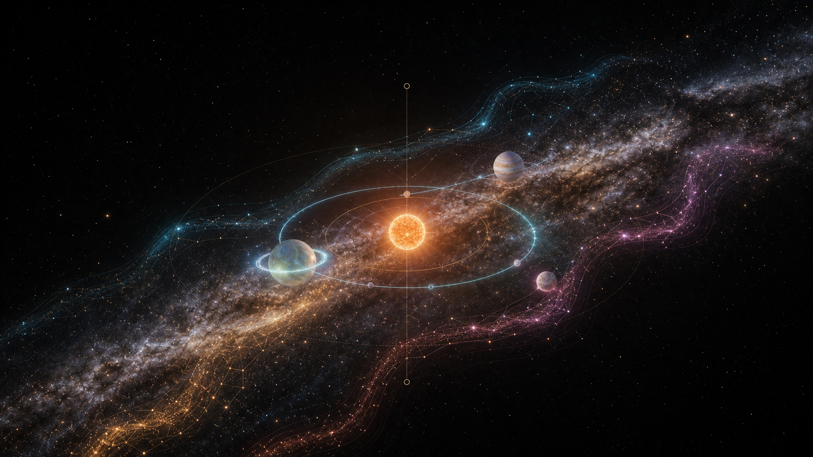
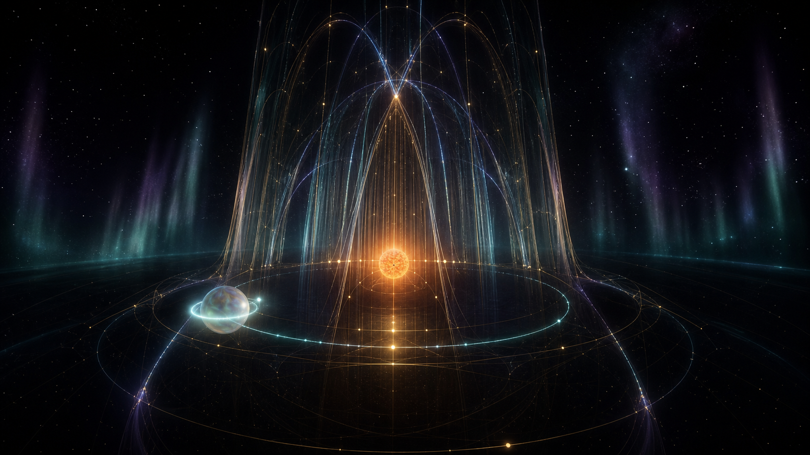
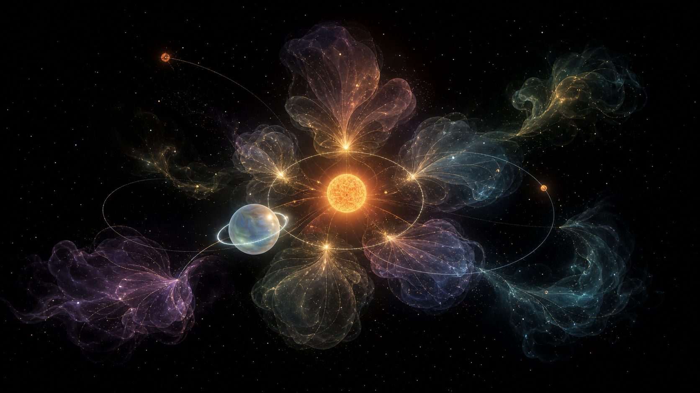
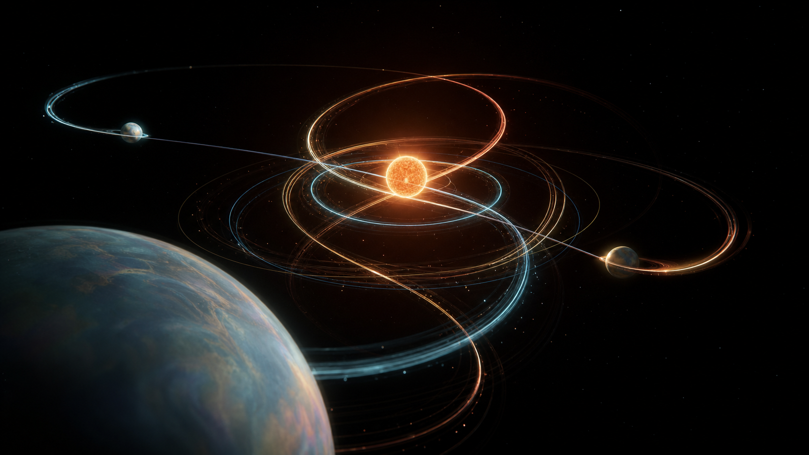
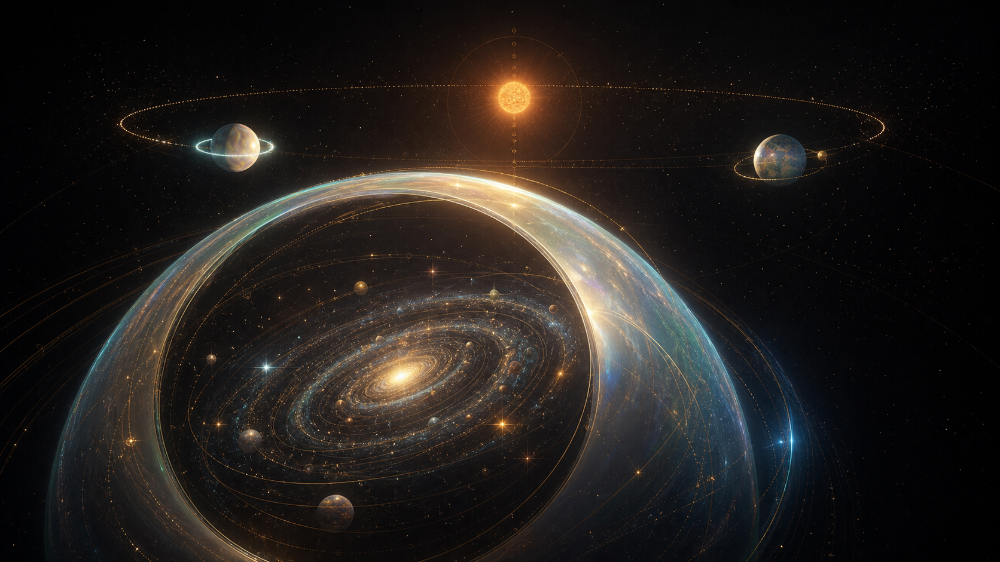
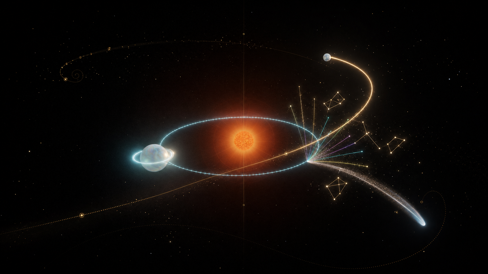
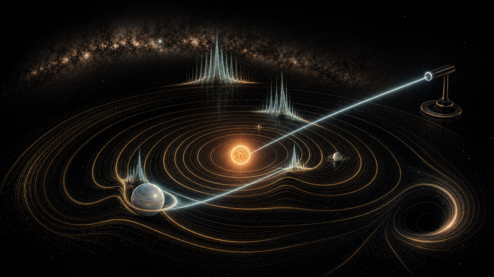

# WAI Gramophone — visual directions

Seven GPT Image 2 concepts for developing the current Three.js instrument without
losing its restrained black, gold, cyan, and opalescent visual language.

## Core principle

Abundance must be earned by play:

- at rest, the scene breathes slowly and remains readable;
- every bright event has a clear musical cause;
- the animation grows with the harmony and then dissolves;
- no permanent particle storm, random flashing, or competing UI.

## Directions

### 01 — Galactic River

A slow Milky Way ribbon becomes the atmosphere and the shared reverb field.
Planet plucks send coherent waves along the dust lanes and briefly reveal
constellations.

Best use: permanent ambient layer and the visual identity of the whole project.

### 02 — Harmonic Cathedral

Stable resonances grow into tall three-dimensional arches and light strings.
A perfect fifth creates a second echoing arch; an octave closes the structure.

Best use: a rare climax when the player builds a genuinely consonant system.

### 03 — Nebula Garden

Intervals bloom as translucent nebula gestures: a fifth forms a five-petal
cloud, an octave forms nested halos, unresolved intervals remain small embers.

Best use: short harmonic rewards. Too visually dense for the permanent state.

### 04 — Orbital Ballet

Played trajectories become temporary silk ribbons in depth. The camera can fly
between planets while the physics remains planar and predictable.

Best use: Explore mode and authored camera transitions.

### 05 — Universes Within Planets

A held planet opens as a gravitational lens into a miniature musical universe.
The player can dive inside, compose a nested system, and return to the parent
orbit.

Best use: a second development phase after the core instrument is complete.

### 06 — Celestial Playground

Launches, comet brushes, and orbit plucks produce short prismatic note fans and
temporary constellations. The response is playful, immediate, and causal.

Best use: the primary interaction language.

### 07 — Spacetime Gramophone

Gravity appears as record-like spacetime grooves. A theremin beam crosses the
grooves and raises visible standing waves.

Best use: spectral analysis, theremin performance, and the low-frequency layer.
Avoid a literal hardware tone arm in the final implementation.

## Recommended synthesis

Use **01 Galactic River** as the world, **06 Celestial Playground** as the
moment-to-moment interaction language, and **02 Harmonic Cathedral** as the
rare reward for real resonance.

Add selected ideas from:

- **04** for camera flight;
- **07** for theremin beams and standing waves;
- **05** later for nested universes.

This produces abundance without clutter because the layers have different
timescales:

1. **Ambient:** Milky Way drift, star breathing, parallax dust.
2. **Playable:** orbit plucks, comet brushes, short colored trails.
3. **Harmonic:** resonance arches, constellation formation, nebula bloom.
4. **Climactic:** a temporary cathedral when the whole system locks into harmony.

## Musical grammar

- The star is the tonic and slow drone.
- Planet distance chooses the register; nearby harmonic wells gently suggest
  `1:1`, `5:4`, `4:3`, `3:2`, and `2:1` without turning the instrument into a
  rigid piano roll.
- The first moon is the parent’s `3:2` overtone; the second is `2:1`.
- A comet is a one-shot arpeggio or percussive gesture, never a permanent voice.
- The Milky Way is the shared reverb and delay field.
- A theremin beam controls pitch continuously with one axis and timbral
  brightness with the other.
- Dissonance is allowed, but it stays visually unresolved instead of becoming
  louder and brighter than consonance.

## Prompt set

All seven frames used the current WAI Gramophone screenshot as a style and
product-context reference, not as an edit target. Shared constraints: 16:9
full-screen Three.js scene; preserve the black, antique-gold, cyan, and
opalescent language; no browser chrome, readable text, fake dashboard, generic
sci-fi HUD, overexposed bloom, or chaotic particle soup.

The seven primary prompts were:

1. A Milky Way ribbon carrying colored harmonic waves through the instrument.
2. Orbital ellipses growing into a three-dimensional light-harp cathedral.
3. Stable intervals blooming as restrained botanical nebula gestures.
4. Played trajectories becoming temporary silk-like ribbons in depth.
5. A selected planet opening into a nested musical universe.
6. Launches and comet brushes assembling temporary prismatic constellations.
7. Spacetime grooves crossed by a theremin beam and visible standing waves.

